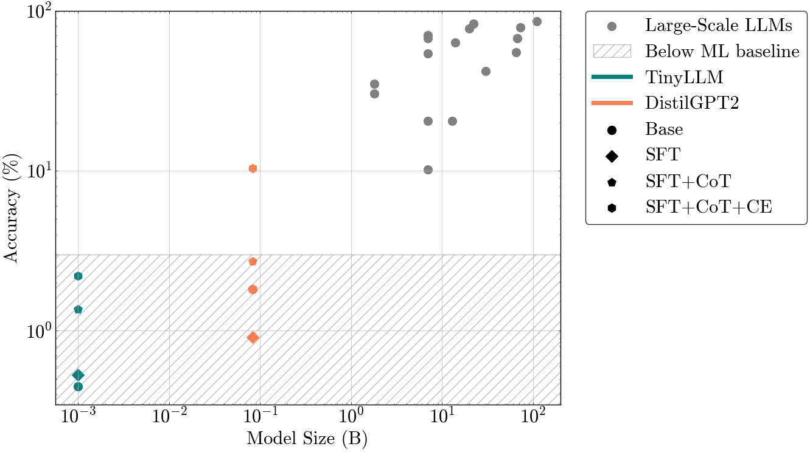

# A Comparative Analysis of Mathematical Reasoning in Large Language Models

## Abstract
This report explores the importance of LLMs within mathematical reasoning. Mathematical problem-solving provides a benchmark for AI models to test their innate reasoning abilities. Along with the rise of LLMs in the past few years, there is a growing interest in understanding their capabilities. LLM performance is highly correlated with model scale (current state-of-the-art LLMs have billions of parameters), which in turn is linked to cost and energy consumption. Questions arise about whether the sole path to increasing performance is through increased parameter size, or if targeted training methods may enhance models further at a fraction of the training cost.

To test this hypothesis, a custom-built dataset was developed for this report, GSM8K-v2, and two compact models are used (`TinyLLM` and `DistilGPT2`, with 10M and 82M parameters, respectively). The GSM8K benchmark is employed to quantify the models’ ability to reason. The models are enhanced through several training methods: Supervised Fine-Tuning (SFT), Chain of Thought (CoT), and a custom Code Evaluator (CE). To provide context to these results, traditional Machine Learning algorithms are used as a baseline benchmark of 3% accuracy, while larger LLMs achieve up to 80% accuracy. 

The base compact models underperform the benchmark, achieving under 2%.  However, the enhanced versions of the models achieve significantly higher performance: `TinyLLM` rises from 0.5% to 2.2%, and `DistilGPT2`'s accuracy rises to over 10%, rivalling some LLMs with nearly 100 times the number of parameters. The results demonstrate that targeted training methods critically shape LLM reasoning. These findings suggest that democratising AI through targeted training is a viable path forward.
## REPOSITORY Structure
- **Models**: Models weights (employ base tokenizer of model). 
- **Poster**: Code to generate plots and data for the poster.
- **Report**: All other code related to running experiments, plots, etc.

## POSTER
### Overview
This folder contains code specifically designed to generate the necessary plots and data for the poster presentation. These visualisations summarise key findings and results from the experiments in the report. 

You can view the poster here:
[Poster - A Comparative Analysis of Reasoning in LLMs](Poster/Poster.pdf)

### File Descriptions
- `dataset_accuracy.py`: Script to inital data on model ability to resonate.
- `plotposter.ipynb`: Plot summary of results (corresponds to figure 3 in poster).

## REPORT
### Overview
This folder contains the core experiments, methodology, and additional code required for the detailed analysis in the report. It includes everything from data preprocessing to model training, evaluation, and result analysis.

### File Descriptions

#### Introduction
N/A

#### Literature Review
N/A

#### Methodology
##### 3.2 Dataset
- **GSM8k** 
    - `plots_report.ipynb`: GSM8K distribution idea (corresponds to Table 3.1 and Fugure 3.1).
- **GSM8K-v2**
    - `new_dataset.ipynb`: GSM8K-v2 creation incluisve of pipeline + manual labelling. The output was uploaded to Hugging Face, available [here](https://huggingface.co/datasets/addaia/gsm8k-v2).

#### Results

##### 4.1 Benchmarks

- **Baseline**
    - `ML_GSM8K.ipynb`: Code + plot to determine baseline.

- **Upper-bound**
    - `lllm.ipynb`: Includes large scale LLM comparison (Figure 4.2) - Accuracy vs Size. 

#### 4.2 Analysis into small LLMs

- `EXPERIMENTS`: Code to train (enhancemnts) models.
- `test_init_model.py`: Code to test base accuracy performance and inference time. 
- `*.out` files: contain the results of the experiments (accuracy per epoch).
- `results_plot.ipynb`: plots the results from the pre vious files (corresponds to Figures and Tables 4.2-4.5)

#### 4.3 Summary

- `lllm.ipynb`: Last cell summarises the results (Figure 4.6). Which are:

#### Discussion

#### Conlsuion
